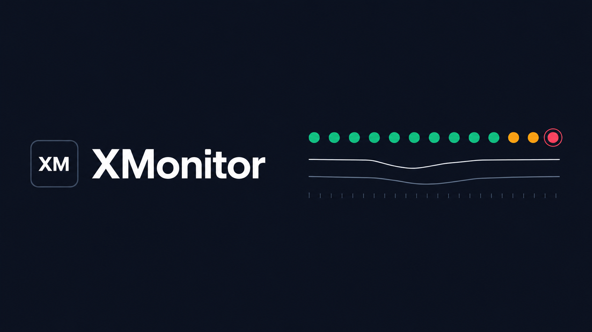

<p align="center">
  
</p>

<p align="center">
  <a href="README.md">English</a>
  &nbsp;·&nbsp;
  <a href="README.zh-CN.md">简体中文</a>
</p>

<h1 align="center">XMonitor</h1>

<p align="center">
  服务还在不在，模型还够不够快。
</p>

XMonitor 是一套自托管的可用性控制台。它按周期探测你登记的系统，也按周期探测你接入的大模型渠道，把状态、延迟和告警放在同一张桌子上。

探测分两类。

**系统。** 接口走 HTTP。页面走本机 Chromium，可以带上访问令牌，目标在登录页后面时也可以走 SSO。监控项可以标成「应当不可达」：这个地址一旦重新能打开，就算故障。用来确认某项服务确实保持关闭。

**模型。** 一个渠道是一座网关，共用地址和密钥，下面挂多个模型。每次探测记录总延迟、首 token 时间（TTFT）和吐字速度。渠道失败时会退避，不再把一个已经不健康的网关打满。

控制台有总览、告警和监控大屏。权限分成管理员、运维、查看，矩阵可以改。配置和历史在 SQLite。把 `XMONITOR_VM_URL` 指到 VictoriaMetrics，更长的时序就写到那边；不配也能跑，序列留在 SQLite。

界面通过 WebSocket 刷新。告警可以打到 Webhook，模板有通用 JSON、钉钉和企业微信。

## 启动

机器要一直跑，用 Docker。要改代码，用源码。

### Docker

需要 Docker Engine 和 Compose v2。

```bash
docker compose up -d --build
```

打开 [http://127.0.0.1:8790](http://127.0.0.1:8790)。

控制台监听 8790。VictoriaMetrics 在容器网络里，同时映射到宿主机的 `127.0.0.1:8428`，方便直接查询。镜像会启动 Chromium，调试端口只开在容器内的 `127.0.0.1:9222`，页面探测用这个浏览器。

数据库写在 `./data`，指标数据写在 `./vm-data`。两个目录都在宿主机上，不进 Git。

模型请求要走代理时，复制示例再填写。Compose 会读本目录的 `.env`。留空就是直连。

```bash
cp .env.example .env
```

### 源码

需要 Node.js 20 或更高版本。

```bash
npm install
npm run dev
```

| 入口 | 地址 |
| --- | --- |
| 控制台 | http://localhost:5173 |
| API 与 WebSocket | http://127.0.0.1:8790 |

`npm run dev` 同时启动 API 和 Vite。开发服务器把 `/api` 和 `/ws` 转到 8790。

页面探测需要本机有一个开着远程调试端口 9222 的 Chromium 或 Chrome。接口探测和模型探测不依赖它。Docker 镜像会自己启动浏览器。本机可以这样开：

```bash
# macOS
"/Applications/Google Chrome.app/Contents/MacOS/Google Chrome" \
  --headless=new --disable-gpu \
  --remote-debugging-address=127.0.0.1 \
  --remote-debugging-port=9222 \
  about:blank
```

```bash
# Linux
chromium --headless=new --disable-gpu \
  --remote-debugging-address=127.0.0.1 \
  --remote-debugging-port=9222 \
  about:blank
```

默认端点是 `ws://127.0.0.1:9222/devtools/browser`。如果要用 HTTP 发现浏览器，把 `XMONITOR_OBSCURA_ENDPOINT` 设为 `http://127.0.0.1:9222`，或在设置页改同一项。

用 API 进程托管生产构建：

```bash
npm run build
npm start
```

然后打开 [http://127.0.0.1:8790](http://127.0.0.1:8790)。不设置 `XMONITOR_VM_URL` 时，时序留在 SQLite。要接 VictoriaMetrics，把它设为 `http://127.0.0.1:8428`。

## 第一次登录

空库会创建一个管理员。

| | |
| --- | --- |
| 用户名 | `admin` |
| 密码 | `admin123` |

在账号菜单里改掉，再把端口暴露给其他人。只有用户表为空时才会播种，已有的 `./data` 会原样沿用。

## 配置

| 变量 | 默认 | 作用 |
| --- | --- | --- |
| `PORT` | `8790` | API 监听端口 |
| `XMONITOR_OBSCURA_ENDPOINT` | `ws://127.0.0.1:9222/devtools/browser` | 页面探测用的 Chromium 调试端点 |
| `XMONITOR_VM_URL` | 未设置 | VictoriaMetrics 地址。不设置则时序留在 SQLite |
| `HTTP_PROXY`、`HTTPS_PROXY`、`NO_PROXY` | 未设置 | 容器出站代理 |

探测间隔、超时、缓慢阈值、Webhook 和 SSO 账号在登录后的设置页修改。密钥在接口返回时打码。

## 目录

```text
server/   API、调度、探测、SQLite
web/      React 控制台
docker/   容器入口
data/     运行时数据库，本地生成，不入库
```

账号、令牌、探测记录和 `.env` 留在运行 XMonitor 的那台机器上。仓库里是代码，以及一份空的环境变量示例。
